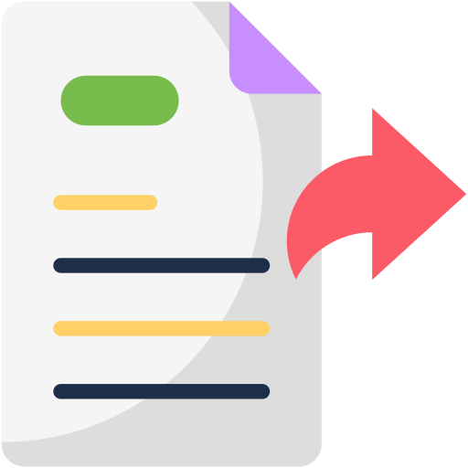

# Wiki Ubiquiti
Una colección de mejoras para los dispositivos basados en EdgeMax.

<div align="center">
    <a href="https://www.ui.com/">
        
    </a>
    <br>
    <h3>Ubiquiti networks x EdgeMax©</h3>
</div>

---


## Índice de contenido

- [Acceso a la CLI y comandos básicos](#acceso-a-la-cli-y-comandos-básicos)
  - [Comandos básicos](#comandos-básicos)
  - [Comandos VI](#comandos-básicos-de-vi)
  - [Acceso GUI](#acceso-a-la-gui)
  - [Certificado](#solucionar-problema-con-certificado-inválido)
- [Configuración inicial del EdgeRouter](#configuración-inicial-del-edgerouter)
  - [Reset fábrica](#realización-de-un-hardware-o-software-reset)
  - [Actualizaciones](#actualizar-edgerouter)
  - [Acceso interfaz](#acceso-a-la-interfaz-de-configuración-edgeos)
  - [Copia seguridad](#configuración-de-copia-de-seguridad-y-restauración)
  - [UISP](#gestión-de-uisp)
- [Hardening del dispositivo](#hardening-del-dispositivo)
  - [Usuarios](#remover-default-user-y-crear-un-usuario)
  - [SSH](#ssh)
- [Firewall EdgeRouter](#firewall-edgerouter)
  - [Tipos de reglas](#tipos-de-reglas)
  - [Firewall básico](#firewall-básico)
  - [PPPoE O2 Movistar](#configurar-una-interfaz-PPPoE-de-Movistar-u-O2-en-un-edgerouter-de-Ubiquiti)
  - [IPv6](#ipv6-on-the-edgerouter)
  - [Dual wan](#dual-wan)
  - [Configuración nat](#configuration-nat)
  - [Port forwarding](#port-forwarding)
  - [ICMP](#ICMP)
- [Routing](#routing)
  - [Load Balancing](#load-balancing)
  - [OSPF](#ospf)
  - [BGP](#bgp)
  - [VRRP](#vrrp)
  - [Public Static IP Addresses](#public-static-ip-addresses)
  - [Static Route](#static-route)
- [LAN](#lan)
  - [DHCP](#dhcp)
  - [IP estáticas LAN](#configurar-IP-estática-para-dispositivo)
  - [Router switch](#router-switch)
  - [DNS dinámico](#dns-dinamico)
- [Añadir listas de seguridad al firewall](#añadir-listas-de-seguridad-al-firewall)
  - [Crear script](#Crear-script)
  - [Programar tarea](#programar-tarea)
  - [Listas IPs](#readme-con-listas-de-ips-públicas)
  - [Revision](#revisión)
  - [Monitorización IPs bloqueadas](#monitorización-de-ips-bloqueadas)
- [Certificado localhost](#posibilidad-de-añadir-un-certificado-a-localhost)
- [OpenVPN](#openvpn)
  - [EdgeRouter como Servidor](#configuración-edgerouter-como-servidor-openvpn.-(Servidor))
  - [EdgeRouter como Cliente](#configuración-edgerouter-como-Cliente-openvpn.-(Cliente))
- [Squidguard](#squidguard-proxy)
  - [Requisitos](#requisito-previo)
  - [Configuración](#ejemplo-de-configuración)
- [Syslog](#syslog)
- [WireGuard](#wireguard)
- [Diagnóstico de red](#herramientas-de-diagnostico-de-red)
- [Unifi](#unifi)		 
- [Conclusión](#conclusión)
---
 Recordar que los pasos aquí expuestos son orientativos.
<p>Recomiendo su lectura y compresión antes de aplicarlo sobre un entorno de producción.</p>

**[`^        back to top        ^`](#wiki-ubiquiti)**
# Acceso a la CLI y comandos básicos
Los lectores aprenderán cómo conectarse y configurar un EdgeRouter por primera vez. Hay muchos entornos diferentes en los que es posible que sea necesario realizar ajustes específicos. Este artículo muestra un escenario de instalación común, pero no es necesario aplicarlo en todos los entornos de red. 

## Comandos básicos
<ul><code>commit:</code>para activar los cambios.</ul>
<ul><code>save:</code> para almacenar la configuración "activa" en la configuración de inicio.</ul>
<ul><code>compare:</code> Para ver qué cambios se han realizado en la configuración.</ul>
<ul><code>configure:</code> modo configuración.</ul>
<ul><code>show:</code> mostrar -> Ejemplo: show firewall</ul>
<ul><code>set:</code> establecer configuración. -> Ejemplo: set firewall name TEST default-action drop</ul>
<ul><code>edit:</code> Para crear la misma acción y reducir la cantidad de repeticiones en la sintaxis completa. -> Ejemplo: edit firewall name TEST</ul>
<ul><code>up:</code> Para subir un nivel de edición -> Ejemplo: volver al set de configuración anterior</ul>
<ul><code>top:</code> Para volver al nivel de edición superior -> Ejemplo: Volver al ser de configuración incial</ul>
<ul><code>discard:</code> para deshacer los cambios no confirmados</ul>
<ul><code>copy:</code> Para crear una nueva acción existente -> Ejemplo: copy name WAN1_LOCAL to name WAN2_LOCAL</ul>
<ul><code>rename:</code> Para cambiar el nombre de la nueva acción -> Ejemplo: rename name WAN2_LOCAL to name WAN2_IN</ul>
<ul><code>load:</code> cargar configuración.</ul>
<ul><code>? o tecla de tab:</code> para mostrar opciones para el nivel de edición especificado</ul>

## Comandos básicos de VI
<ul><code>wq</code>Guardar y salir.</ul>
<ul><code>:q!</code>Salir sin guardar.</ul>
<ul><code>u</code>Deshace última acción.</ul>
<ul><code>i</code>modo inserción por la izquierda.</ul>
<ul><code>a</code>modo inserción por la derecha.</ul>
<ul><code>dd</code>Elimina la línea actual.</ul>
<ul><code>p</code>Copia la palabra actual.</ul>
<ul><code>A</code>Pone le puntero al final de la línea.</ul>
<ul><code>w</code>Salta de palabra en palabra.</ul>
<ul><code>D</code>Borra desde el puntero hacia el final de la línea.</ul>
<ul><code>o</code>Agrera una línea debajo de la actual.</ul>
<ul><code>O</code>Agrega una línea encima de la actual.</ul>
<ul><code>P</code>Copia la palabra pegada.</ul>
<ul><code>gw</code>Copia la palabra actual.</ul>
<ul><code>help</code>Ayuda.</ul>

## Acceso a la GUI
Mediante un navegador, accedemos a <code>https://192.168.1.1</code>. Cargara una web donde deberemos introducir unas credenciales. En este caso las que vienen de fábrica.
<p></p>

La contraseña por defecto:
<ul><code>Usuario:</code> ubnt</ul>
<ul><code>Contraseña:</code> ubnt</ul>
  
Una vez introducidas las credenciales, se cargará la web de gestión del EdgeRouter.
<p></p>

### Instrucciones de uso con Putty o similar:
<p></p>

### Instrucciones de uso con GUI:
0. Acceda a la interfaz de usuario web de EdgeRouter
1. Navegue a la parte superior derecha de la interfaz de usuario web.
<p></p>

## Solucionar problema con certificado inválido
<p><sup>En los comandos de OpenSSL a continuación, reemplace los nombres de archivo en TODAS LAS MAYÚSCULAS con las rutas y nombres de archivo reales con los que está trabajando.</sup></p>
Cuando intentamos acceder vía web, nos indica que el certificado es inválido al ser autofirmado:
<p></p>

Podemos ver el contenido del archivo de certificado <code>.PEM</code>:
```bash
openssl x509 -in CERTIFICATE.pem -text -noout
```

Para poder solucionar, debemos descargar el certificado del navegador. Nos descarga un archivo <code>.pem</code>:
<p></p>
<p></p>

Una vez descargado tenemos que cambiar el <code>.pem</code> a <code>.crt</code> con OpenSSL:
```bash
openssl x509 -outform der -in CERTIFICATE.pem -out CERTIFICATE.crt
```
<p></p>

Despues de haber cambiado el formato, procedemos a instalar el certificado en la raiz de confianza:
<p></p>

Una vez importado el certificado y borrado las cookies, ya no nos indicará que el certificado no es de confianza.
<p></p>

Tambien podemos migrar el <code>.pem</code> a <code>.pfx</code> con OpenSSL:
```bash
openssl pkcs12 -export -in CERTIFICATE.pem -inkey CERTIFICATE.key -out CERTIFICATE.pfx
```
<p><sup>Para ello necesitas la private key del certificado.</sup></p>

---
**[`^        back to top        ^`](#wiki-ubiquiti)**
# Configuración inicial del EdgeRouter:

La configuración inicial del EdgeRouter implica la configuración básica del dispositivo para que pueda conectarse a Internet y administrar el tráfico de red.

## Realización de un Hardware o Software Reset
El EdgeRouter se puede restablecer a los valores predeterminados de fábrica utilizando un hardware o software método de restablecimiento

Hardware Reset: Borra todos los archivos de configuración y del sistema, restableciendo el dispositivo al estado predeterminado de fábrica.
Software Reset: Solo borra la configuración y deja intactos los demás archivos del sistema.

 <strong><font style="vertical-align: inherit;">ATENCIÓN: </font></strong> Los métodos de reinicio de hardware a continuación borrarán todos los archivos de configuración y del sistema.

<details>
    <summary>Realización de un restablecimiento de hardware :</summary>

### Instrucciones de uso para realizar reset button:

1. Verifique que EdgeRouter esté completamente iniciado. 
2. Mantenga presionado el reinicio.
3. Los LED del puerto comenzarán a encenderse en secuencia, comenzando por el puerto 1 y terminando en el último puerto.
4. Continúe presionando el botón de reinicio durante aproximadamente 10 segundos hasta que el LED del puerto 1 se encienda nuevamente.
5. Suelte el botón de reinicio.
6. El EdgeRouter se reiniciará.
7. Espere a que se complete el reinicio.
8. Conéctese al eth0 y administre el dispositivo abriendo un navegador y navegando a la <code>https://192.168.1.1</code> dirección IP predeterminada.
<p></p>

### Instrucciones de uso para realizar un Power On Reset:

1. Desconecte el cable de alimentación del EdgeRouter.
2. Mientras vuelve a conectar el cable de alimentación al EdgeRouter, mantenga presionado el reinicio .
3. Los LED del puerto comenzarán a encenderse en secuencia, comenzando por el puerto 1 y terminando en el último puerto.
4. Continúe presionando el botón de reinicio durante aproximadamente 10 segundos hasta que el LED del puerto 1 se encienda nuevamente.
5. Suelte el botón de reinicio.
6. El EdgeRouter se reiniciará.
7. Espere a que se complete el reinicio.
8. Conéctese al eth0 y administre el dispositivo abriendo un navegador y navegando a la <code>https://192.168.1.1</code> dirección IP predeterminada.

&nbsp;
</details>
&nbsp;


<details>
    <summary>Realización de un reinicio de software:</summary>

### Instrucciones de uso con GUI:

0. Acceda a la interfaz de usuario web de EdgeRouter.
1. Navegue a la Sistema en la parte inferior izquierda de la interfaz de usuario web.
2. Restablezca la configuración a los valores predeterminados presionando el Restablecer a los valores predeterminados en la Restablecer  predeterminados .
3. El EdgeRouter solicitará que se reinicie el dispositivo para completar el restablecimiento.
4. Espere a que se complete el reinicio.
5. Conéctese al eth0 y administre el dispositivo abriendo un navegador y navegando a la <code>https://192.168.1.1</code> dirección IP predeterminada 

### Instrucciones de uso con CLI:

0. acceda a la interfaz de línea de comandos de EdgeRouter.
1. Sobrescriba el archivo de inicio actual (config.boot) con el archivo de inicio predeterminado (config.boot.default).
<ul><code>sudo cp /opt/vyatta/etc/config.boot.default /config/config.boot</code></ul>
Haga clic para copiar
2. Reinicie EdgeRouter.
<ul><code>reboot</code></ul>
<ul><code>Proceed with reboot? [confirm]</code></ul>
3. Espere a que se complete el reinicio.
4. Conéctese al eth0 y administre el dispositivo abriendo un navegador y navegando a la <code>https://192.168.1.1</code> dirección IP predeterminada  

&nbsp;
</details>
&nbsp;

## Actualizar EdgeRouter
Antes de Realizar cualquier cambio o configuración en los equipos Ubiquiti EdgeMax debe contar con la última versión del Firmware.
<a title="download" href="https://www.ui.com/download/edgemax/"></a>

Y seguir la guía que indica fabricante: <a href="https://help.ui.com/hc/en-us/articles/205146110-EdgeRouter-How-to-Upgrade-the-EdgeOS-Firmware">Cómo actualizar el firmware de EdgeOS</a>

## Acceso a la interfaz de configuración EdgeOS
<details>
    <summary>Opción 1:</summary>

### Instrucciones de uso con IP ESTÁTICA:

1. Conecte un cable Ethernet desde el puerto Ethernet del ordenador al puerto eth0 del EdgeRouter.
2. Configure el adaptador de Ethernet en su sistema host con una dirección IP estática en la subred  <code>192.168.1.x</code>.
3. Inicie el explorador web. Escriba <code>https://192.168.1.1</code> en la barra de direcciones. Pulse Intro (PC) o Retorno (Mac).
4. Introduzca ubnt en los campos de nombre de usuario y contraseña. Lea el acuerdo de licencia de Ubiquiti y marque la casilla junto a I agree to the terms of this License Agreement (Acepto los términos de este acuerdo de licencia) para aceptarlo. Haga clic en Login (Inicio de sesión).

&nbsp;
</details>
&nbsp;

<details>
    <summary>Opción 2:</summary>

### Instrucciones de uso con DHCP:

1. Conecte un cable Ethernet de eth1 en el EdgeRouter a un segmento de LAN que ya tiene un servidor DHCP.
2. Para comprobar la dirección IP del EdgeRouter, utilice uno de los métodos siguientes:
<ul>2.1 Configure el servidor DHCP para que proporcione una dirección IP específica al EdgeRouter en función de su dirección MAC (en la etiqueta).</ul>
<ul>2.2 Deje que el EdgeRouter obtenga una dirección IP y luego compruebe el servidor DHCP para ver qué dirección IP se asignó.</ul>
3. Inicie el explorador web. Introduzca la dirección IP correcta en el campo de dirección. Pulse Intro (PC) o Retorno (Mac).
4. Introduzca ubnt en los campos de nombre de usuario y contraseña. Lea el acuerdo de licencia de Ubiquiti y marque la casilla junto a I agree to the terms of this License Agreement (Acepto los términos de este acuerdo de licencia) para aceptarlo. Haga clic en Login (Inicio de sesión).

&nbsp;
</details>
&nbsp;

## Configuración de copia de seguridad y restauración 
Realizar una copia de seguridad y restaurar el archivo de configuración de un EdgeRouter.

<details>
    <summary>Realización copia de seguridad y restauración vía GUI:</summary>

## Instrucciones de uso para realizar vía GUI

1. Navegue al sistema en la parte inferior izquierda de la GUI para descargar el archivo de configuración de la copia de seguridad.
<ul><code>**Sistema** > **Gestión de configuración** y **mantenimiento de dispositivos** > **Back Up Config**</code></ul>
2. Descargue el archivo de configuración de la copia de seguridad haciendo clic en el Descargar .
3. EdgeRouter le pedirá que guarde el archivo en su ordenador.
<p></p>

## Instrucciones de uso para restaurar vía GUI
1. Navegue al sistema en la parte inferior izquierda de la GUI para descargar el archivo de configuración de la copia de seguridad.
<ul><code>**Sistema** > **Gestión de configuración** y **mantenimiento de dispositivos** > **Restore Config**</code></ul>
2. Cargue el archivo de configuración de la copia de seguridad haciendo clic en el **Upload a file** .
3. EdgeRouter solicitará que se reinicie el dispositivo para completar la restauración.
<p></p>

## Instrucciones de uso para realizar/restaurar vía UNMS
Para realizar o restaurar vía UNMS deben seguir los pasos de este artículo:
<ul><a href="https://help.ui.com/hc/en-us/articles/360002535514">realizar o restaurar vía UNMS</a></ul>

&nbsp;
</details>
&nbsp;

<details>
    <summary>Realización copia de seguridad y restauración vía CLI:</summary>

## Instrucciones de uso para realizar vía CLI

<p>1. Puede hacerlo usando el botón CLI en la GUI o usando un programa como PuTTY.</p>
<p>2. Ingrese al modo de configuración y asegúrese de que todos los cambios en las configuraciones actualmente activas/en funcionamiento se guarden en la arranque/inicio.</p>
<ul><code>commit ; save</code></ul>
<p>3. Guarde el archivo de configuración <code>config.boot</code> en una máquina remota mediante una de estas opciones: TFTP, SCP, FTP o SFTP.</p> 

```bash
  scp://<user>:<passwd>@<host>/<file>   Save to file on remote machine
  sftp://<user>:<passwd>@<host>/<file>  Save to file on remote machine
  ftp://<user>:<passwd>@<host>/<file>   Save to file on remote machine
  tftp://<host>/<file>                  Save to file on remote machine
```
Y con el comando <code>**save tftp://host/config.boot**</code> guardamos el archivo de configuración.
<p>4. Verifique el contenido de la configuración de inicio abriendo el <code>config.boot</code> con un editor de texto y compare con el del equipo que se haya exportado correctamente.</p>
<ul><code>cat /config/config.boot</code></ul>

## Instrucciones de uso para restaurar vía CLI
<p>1. Puede hacerlo usando el botón CLI en la GUI o usando un programa como PuTTY.</p> 
<p>2. Compare las diferencias entre la respaldo/funcionamiento y la activa.</p>
<p>3. Guarde el archivo de configuración <code>config.boot</code> en una máquina remota mediante una de estas opciones: TFTP, SCP, FTP o SFTP.</p>

```bash
  scp://<user>:<passwd>@<host>/<file>   Load from file on remote machine
  sftp://<user>:<passwd>@<host>/<file>  Load from file on remote machine
  ftp://<user>:<passwd>@<host>/<file>   Load from file on remote machine
  http://<host>/<file>                  Load from file on remote machine
  tftp://<host>/<file>                  Load from file on remote machine
```

Y con el comando <code>**load tftp://host/config.boot**</code> guardamos el archivo de configuración.
<p>4. Verifique que la restauración ha sido correcta y con el contenido de la configuración del <code>config.boot</code> con un editor de texto y compare con el del equipo que se haya importado correctamente.</p>
<ul><code>cat /config/config.boot</code> y con el comando <code>compare</code></ul>
<p>5. Una vez asegurado de que todos los cambios en las configuraciones actualmente activas/en funcionamiento son correctas se procede a guardar en el arranque/inicio.
<ul><code>commit ; save</code></ul></p>

&nbsp;
</details>
&nbsp;

- También hay una opción que nos indican Ubiquiti, ellos la llaman **desinfectar** o **limpiar** las configuraciones de EdgeRouter para eliminar toda la información personal y confidencial.
Ubiquiti nos dedica un articulo muy detallado para esta opción. Esta opción de **desinfectar** es cuando necesitas ayuda y quieres enviar la plantilla o "cachos" de la plantilla al foro o fabricante.
<ul><a href="https://help.ui.com/hc/en-us/articles/360012074414">Desinfectar las configuraciones de EdgeRouter</a></ul>


## Gestión de UISP
Puede administrar el dispositivo mediante el UISP, que le permite configurar, supervisar, actualizar y realizar copias de seguridad de sus dispositivos a través de una sola aplicación.
1. Para empezar, vaya a <a href="https://help.ui.com/hc/en-us/articles/115012196527-UNMS-Installation-Guide">UISP - Guía de instalación </a>
2. Despues logarse en la web de UISP <a href="uisp.ui.com">uisp.ui.com</a>
3. Pueden utilizar la aplicación móvil, enlace de configuración: <a href="https://help.ui.com/hc/en-us/articles/115010608187-UISP-Mobile-App#2">UISP-Mobile-App</a>
- Android: <a href="https://play.google.com/store/apps/details?id=com.ubnt.umobile">Android</a>
- IOS: <a href="https://apps.apple.com/us/app/unms-mobile/id1183022489">IOS</a>

 Cuidado con la opción cloud. Cuando creas la cuenta indica:
<ul><code>Una consola en la nube de UISP gratuita requiere al menos 10 dispositivos Ubiquiti activos en total después del día 30 de la configuración.</code></ul>

---
**[`^        back to top        ^`](#wiki-ubiquiti)**
# Hardening del dispositivo
El hardening del dispositivo Edgerouter se refiere a la aplicación de medidas de seguridad para proteger y fortalecer la configuración del enrutador Edgerouter.

Esto incluye medidas de seguridad como cambiar las contraseñas predeterminadas de inicio de sesión, asegurarse de que la última versión del firmware esté instalada, deshabilitar los servicios no utilizados, como SSH o Telnet, y configurar el firewall para bloquear tráfico no deseado que configuraremos en el siguiente punto.

## Habilitar funciones de rendimiento
Offloading se utiliza para ejecutar funciones del enrutador usando el hardware directamente, en lugar de un proceso de funciones de software.  El beneficio de la descarga en EdgeOS es un mayor rendimiento y rendimiento al no depender de la CPU para las decisiones de reenvío. Enlace a la web oficial de Ubiquiti: <a href="https://help.ui.com/hc/en-us/articles/115006567467-EdgeRouter-Hardware-Offloading">EdgeRouter-Hardware-Offloading</a></p>
**UTILIZAR CON CUIDADO**.

Para ER-X,ER-X-SPF,EP-R6
```bash
configure
set system offload hwnat enable
set system offload ipsec enable
commit ; save
```

Para todos los demás modelos de Edgerouter
```bash
configure
set system offload ipv4 forwarding enable
set system offload ipv4 gre enable
set system offload ipv4 pppoe enable
set system offload ipv4 vlan enable
set system offload ipv6 forwarding enable
set system offload ipv6 pppoe enable
set system offload ipv6 vlan enable
set system offload ipsec enable
commit ; save
```

## Remover default user y crear un usuario
Antes de eliminar el usuario por defecto, crear un usuario, en la GUI en la pestaña USERS o por CLI:
```bash
set system login user <user>
set system login user <user> level admin
set system login user <user> authentication plaintext-password <contraseña>
set system login user <user> full-name <Nombre>
commit ; save
```
<sup>La contraseña se encripta una vez introducida en texto plano</sup>

Despues eliminarmos el usuario por defecto
```bash
configure
delete system login user ubnt
commit ; save
```
**PD:** Si creas un usuario como operador, no tiene acceso por ssh.
```bash
This account is currently not available.
Connection to 192.168.1.1 closed.
```

## SSH

### Añadir una clave ssh pública a EdgeRouter
Para poder generar una clave pública hay muchas opciones, pero os recomiendo con Putty.
<p>Si no lo conocen, os dejo el tutorial: <a href="https://www.hostinger.es/tutoriales/llaves-ssh#Paso_2_-_Genera_un_par_de_SSH_key">Generar SSH Keys (Llaves SSH) en PuTTY</a></p>

```bash
$ scp ~/.ssh/id_rsa.pub <ip-of-edgerouter>:/tmp
```
<ul><code>Pueden utilizar Filezilla o similar para enviar el archivo.</code></ul>

Accedemos al equipo y configuramos la clave pública generada:
```bash
configure  
loadkey <user> /tmp/id_rsa.pub  
sudo chown -R <user> /home/<user>
commit ; save
```

### Comprobación de acceso
  Asegúrate de que puedes acceder con tu clave pública antes de salir de la sesión SSH actual.
Probamos acceso sin salir de la sesión SSH por si tienes que hacer un rollback:
```bash
$ ssh <user>@<ip-of-edgerouter>
exit
```

### Desactivar la autenticación de contraseñas en texto plano
Si puede iniciar sesión con éxito en el EdgeRouter, un paso para reforzar la seguridad de su EdgeRouter es eliminar la opción de utilizar una contraseña de texto simple.  
  Asegúrate de que puedes acceder con tu clave pública antes de desactivar la autenticación en texto plano.

```bash
configure
set service ssh disable-password-authentication
commit ; save
```
### Asegurar acceso a la GUI y ssh
Pueden asegurar el acceso al ssh o gui con vuestro rango de IPs, es opcional, pero seguro.
(opcional)
```bash
configure
set service gui listen-address <lan ip address/range>
set service ssh listen-address <lan ip address/range>
commit ; save
```

Recomendado, cambiar el puerto de ssh y habilitar V2
```bash
configure
set service ubnt-discover disable
set service ssh protocol-version v2
set service ssh port <port>
delete service telnet
commit ; save
```

---
**[`^        back to top        ^`](#wiki-ubiquiti)**
# Firewall Edgerouter
El Firewall EdgeRouter es conocido por su potencia y flexibilidad. Se basa en una plataforma de hardware de alto rendimiento que puede manejar grandes cantidades de tráfico de red con un bajo impacto en el rendimiento del sistema. Además, el Firewall EdgeRouter es altamente configurable y se puede ajustar para satisfacer las necesidades específicas de una organización o aplicación.

El Firewall EdgeRouter admite varias funciones avanzadas de firewall, como reglas de filtrado de paquetes, filtrado de contenido, prevención de intrusiones y detección de tráfico anómalo, entre otras. También tiene la capacidad de crear VLANs y segmentar la red en zonas separadas para una mayor seguridad.

### TIPOS DE REGLAS
* Para poder añadir una regla, deben saber que hay 3 WAN en Ubiquiti:
  - `WAN_IN` = es para paquetes externos que llegan a su enrutador y se dirigen a su LAN. Deje el destino en blanco. Solo debe preocuparse por el grupo de direcciones de origen BlockedIP. Coloque la regla DESPUÉS de que los dos primeros normales acepten establecidos/relacionados y eliminen los no válidos.
  - `WAN_LOCAL` = es para paquetes externos que llegan a su enrutador y se dirigen a su propio enrutador. El origen debe volver a ser el grupo de direcciones BlockedIP y dejar el destino vacío. También ponga después de las mismas dos reglas que arriba.
  - `WAN_OUT` = Para bloquear el saliente, debe crear un nuevo conjunto de reglas y adjuntarlo como OUT a ethX con la aceptación predeterminada. Luego agregue una sola regla para colocar con el grupo de direcciones de destino BlockedIP y nada en el origen. 

* Tipos de LAN
  - `LAN_IN` = Todo lo que ingresa al enrutador desde su LAN que está destinado a otro lugar WAN u otra LAN. En una configuración SMB o SOHO, esto probablemente sea explícitamente permisivo. En un entorno empresarial, esto puede ser permisivo o no (por ejemplo, bloquear todo el tráfico saliente excepto SFTP en un puerto no estándar)
  - `LAN_LOCAL` = Todo lo que ingresa al enrutador desde su LAN destinado al enrutador.

Las reglas se añaden en las `WAN`, dependiendo del sentido que queramos hacer.
Si desea bloquear el entrante y saliente, debemos de añadir en la IN u OUT, y en el LOCAL para bloquear los accesos hacia el sentido del router.

Ejemplo para una `WAN`con pppoe,
- Indicamos la interfaz a la WAN_IN la pppoe en modo `IN`
- Indicamos la interfaz a la WAN_LOCAL la pppoe en modo `LOCAL`
- Indicamos la interfaz a la WAN_IN la pppoe en modo `OUT`.
    - <sup>No olvidar poner la acción por defecto en ACCEPT, o denegará todo el tráfico desde la red interna.</sup>
- Añadiríamos la regla en la IN u OUT y en el LOCAL.
- Despues realizar una prueba para comprobar la acción deseada.

<sup>En EdgeMax no es necesario añadir la misma regla en IN y OUT. Denegará o permitirá la acción deseada en cualquiera de ellas.</sup>

### Firewall básico
Aquí viene la parte más difícil. Si anteriormente no te has peleado con un Firewall algunos conceptos te serán extraños, pero intentare explicar cada paso con algún ejemplo, haciéndolo mas fácil de entender.

- Configuración básica del firewall. Asignar la interfaz de la WAN que vayan a utilizar:
```bash
configure

set firewall name WAN_IN default-action drop
set firewall name WAN_IN description 'WAN to internal'
set firewall name WAN_IN rule 10 action accept
set firewall name WAN_IN rule 10 description 'Allow established/related'
set firewall name WAN_IN rule 10 state established enable
set firewall name WAN_IN rule 10 state related enable
set firewall name WAN_IN rule 20 action drop
set firewall name WAN_IN rule 20 description 'Drop invalid state'
set firewall name WAN_IN rule 20 state invalid enable

set firewall name WAN_LOCAL default-action drop
set firewall name WAN_LOCAL description 'WAN to router'
set firewall name WAN_LOCAL rule 10 action accept
set firewall name WAN_LOCAL rule 10 description 'Allow established/related'
set firewall name WAN_LOCAL rule 10 state established enable
set firewall name WAN_LOCAL rule 10 state related enable
set firewall name WAN_LOCAL rule 20 action drop
set firewall name WAN_LOCAL rule 20 description 'Drop invalid state'
set firewall name WAN_LOCAL rule 20 state invalid enable

set interfaces ethernet eth0 firewall in name WAN_IN
set interfaces ethernet eth0 firewall local name WAN_LOCAL

commit ; save
```

### Configurar una interfaz PPPoE de Movistar u O2 en un EdgeRouter de Ubiquiti
<p> Asegúrate de cambiar los parámetros del ISP y utilizar los que el ISP os indique.</p>


<p>1. Lo primero es entrar en la web de gestión del Edgerouter y pulsar en la pestaña Wizards de la parte superior derecha. Esto nos cargara un grupo de asistentes de configuración en la parte izquierda. Pulsamos sobre el que se llama WAN + +2LAN2. Esto nos cargara un formulario que deberemos rellenar con los datos de acuerdo a nuestras necesidades.</p>
<p></p>

<p>2. Internet port: En esta sección definiremos como está conectado nuestro Edgerouter al router HGU de Movistar o O2.</p>
<p><code>Port</code>: En el menú despegable seleccionamos el puerto de ethernet con el que está conectado al router HGU de Movistar o O2, etho o eth4.</p>
<p><code>Internet connection type</code>: Aquí seleccionamos PPPoE y rellenamos los campos de ls siguiente manera:</p>
<ul><p><code>Account name</code>: adsl@telefonicapa</ul></p>
<ul><p><code>Password</code>: adslppp</ul></p>
<p></p>

<p>3. LAN ports: Desplegando está sección podremos configurar la IP que tendrá nuestro router y habilitaremos el DHCP por defecto para que asigne IPs a aquellos equipos que se conecten al router.</p>
<sup>Tener en cuenta que el rango de IP debe ser distinto al que esta nuestro Edgerouter con el router HGU de Movistar o O2. La opción de DHCP viene habilitada por defecto, así que no la tocamos y la dejamos como está.</sup>
<p></p>

<p>4. User setup: Por último, es recomendable cambiar la contraseña del usuario ubnt que viene por defecto por otra más segura.</p>
<p></p>

<p>Para aplicar la configuración definida, pulsamos sobre Apply.</p>
<p> No toméis estos pasos al pie de la letra. Utilízalos como una guía, ya que la configuración de vuestra red puede diferir con la de aquí expuesta. Pudiendo causar un mal funcionamiento de vuestra red.</p>

Puedes asignar la MAC del HGU a la WAN:

## IPv6 on the EdgeRouter
El cortafuegos para IPv6 es independiente del cortafuegos de IPv4 y actualmente debe configurarse mediante la CLI ("establecer el nombre de ipv6 del cortafuegos...", etc.). O el árbol de configuración en la interfaz de usuario web, por lo que deberá crear reglas de IPv6 por separado y aplicarlas a la interfaz/dirección adecuada.

### Firewall
Primero, es importante que configuremos el firewall ya que la política predeterminada es "aceptar" y sus clientes de LAN tendrán IP enrutables.

En comparación con nuestras reglas de firewall IPv4, hay una diferencia importante: debemos permitir ICMPv6 y DHCP para que DHCPv6-PD funcione.

- Cree una política para clientes WAN->LAN:
~~~bash
edit firewall ipv6-name WAN6_IN
set default-action dropset rule 10 action accept
set rule 10 description "allow established"
set rule 10 protocol all
set rule 10 state established enable
set rule 10 state related enableset rule 20 action drop
set rule 20 description "drop invalid packets"
set rule 20 protocol all
set rule 20 state invalid enableset rule 30 action accept
set rule 30 description "allow ICMPv6"
set rule 30 protocol icmpv6
top
~~~

- Ahora cree una política para WAN->Router (también conocido como local):
~~~bash
edit firewall ipv6-name WAN6_LOCAL
set default-action dropset rule 10 action accept
set rule 10 description "allow established"
set rule 10 protocol all
set rule 10 state established enable
set rule 10 state related enableset rule 20 action drop
set rule 20 description "drop invalid packets"
set rule 20 protocol all
set rule 20 state invalid enableset rule 30 action accept
set rule 30 description "allow ICMPv6"
set rule 30 protocol icmpv6set rule 40 action accept
set rule 40 description "allow DHCPv6 client/server"
set rule 40 destination port 546
set rule 40 source port 547
set rule 40 protocol udp
top
~~~

- Ahora adjunte las políticas a su interfaz WAN: 
~~~bash
set interfaces ethernet eth1 firewall in ipv6-name WAN6_IN
set interfaces ethernet eth1 firewall local ipv6-name WAN6_LOCAL
~~~

- Ahora solicitaremos direcciones IPv6 a nuestro ISP. Es posible que deba descubrir manualmente la longitud del prefijo que proporciona su ISP. Las dos longitudes más comunes son /56 y /64.
> Nota: Usaremos SLAAC (Configuración automática de direcciones sin estado) en lugar de DHCP con estado (que es como funciona DHCP IPv4).

~~~bash
edit interfaces ethernet eth1
set dhcpv6-pd pd 0 prefix-length /64
set dhcpv6-pd pd 0 interface eth0 host-address ::1
set dhcpv6-pd pd 0 interface eth0 prefix-id :0
set dhcpv6-pd pd 0 interface eth0 service slaac
top
~~~

En resumen, le estamos diciendo a eth1 (WAN) que proporcione delegación de prefijo a eth0 (LAN). Si también está usando eth2 para un segundo puerto LAN, necesitará usar el prefijo-id:1 para esa interfaz.

> Para cualquiera que use vlans, lo siguiente también funciona:
~~~
set interfaces ethernet eth2 vif 17 ipv6 router-advert prefix ::/64
~~~

- Para hacerlo vía [GUI](https://davidwesterfield.net/2021/03/enabling-ipv6-prefix-delegation-on-att-internet-for-a-second-firewall/). No lo recomiendo.

- Información
   - [LINK](https://davidwesterfield.net/2020/06/edgerouter-4-ipv6-setup)
   - [LINK](https://noobient.com/2018/08/02/ipv6-on-ubnt-edgerouter-x-with-digi-pppoe/#Firewall)
   - [LINK](https://help.pentanet.com.au/hc/en-us/articles/4403292092307-IPv6-configuration-on-Ubiquiti-Edgerouters)

### Opciones básicas del cortafuegos
Este cortafuegos básico permite a los usuarios hacer ping a un dispositivo IPv6 desde Internet. El resto del tráfico hacia el dispositivo está bloqueado (acción por defecto drop). 

```bash
set firewall ipv6-name ipv6-fw default-action drop
set firewall ipv6-name ipv6-fw description 'IPv6 firewall'
set firewall ipv6-name ipv6-fw rule 1 action accept
set firewall ipv6-name ipv6-fw rule 1 log disable
set firewall ipv6-name ipv6-fw rule 1 protocol icmpv6
set firewall ipv6-name ipv6-fw rule 1 description 'allow ICMPv6 traffic'
set firewall ipv6-name ipv6-fw rule 10 action accept
set firewall ipv6-name ipv6-fw rule 10 state established enable
set firewall ipv6-name ipv6-fw rule 10 state related enable
```

### Permitir que un host sea de acceso público
```bash
set firewall ipv6-name ipv6-fw rule 4 action accept
set firewall ipv6-name ipv6-fw rule 4 description 'allow access to host x'
set firewall ipv6-name ipv6-fw rule 4 destination address '2001:xxxx:xxxx:xxxx:xxxx:xxxx:xxxx:xxx
```
## Dual-wan

### Establecer nat para ambas interfaces

```bash
set load-balance group LB-GROUP interface eth3 failover-only
set load-balance group LB-GROUP interface eth3 route-test initial-delay 60
set load-balance group LB-GROUP interface eth3 route-test interval 10
set load-balance group LB-GROUP interface eth3 route-test type ping target 8.8.8.8

set load-balance group LB-GROUP interface pppoe0 route-test initial-delay 60
set load-balance group LB-GROUP interface pppoe0 route-test interval 10
set load-balance group LB-GROUP interface pppoe0 route-test type ping target 8.8.8.8

set load-balance group LB-GROUP lb-local enable
set load-balance group LB-GROUP lb-local-metric-change disable
```

## Configuration NAT
Ejemplo de como configurar NAT:
```bash
configure
set service nat rule 5000 description NAT-TO-WAN
set service nat rule 5000 log disable
set service nat rule 5000 outbound-interface eth0
set service nat rule 5000 protocol all
set service nat rule 5000 source address 172.22.1.0/24
set service nat rule 5000 type masquerade
commit && save && exit
```

### Port Forwarding
Seleccione las interfaces WAN y LAN que se utilizarán para el reenvío de puertos.
- Pueden realizar el procedimiento mediante la GUI o mediante CLI.
- Mediante CLI: Firewall/NAT > Port Forwarding

  Asegúrate de cambiar el rando de la red a la de tu red y la interfaz a modificar
```bash
configure

set port-forward auto-firewall enable
set port-forward hairpin-nat enable
set port-forward wan-interface eth0
set port-forward lan-interface eth1

set port-forward rule 1 description https
set port-forward rule 1 forward-to address 192.168.1.10
set port-forward rule 1 forward-to port 443
set port-forward rule 1 original-port 443
set port-forward rule 1 protocol tcp

commit ; save
```

## ICMP
Para aquellos de ustedes que desean usar la GUI para habilitar/deshabilitar ICMP en una de sus interfaces WAN de EdgeRouter.

<ol>
<li>inicie sesión en su EdgeRouter.</li>
<li>haga clic en la pestaña <code>Firewall/NAT</code>.</li>
<li>haga clic en la pestaña <code>Firewall Policies</code>.</li>
<li>localice el conjunto de reglas llamado <code>WAN_LOCAL</code>, aquí es donde permitiremos hacer ping. edite el conjunto de reglas.</li>
<li>haga clic en el botón <code>Agregar nueva regla</code>. Aquí es donde agrega una nueva regla.</li>
<li>En la descripción, coloque algo como Permitir ping o denegar ping.</li>
<li>En <code>Acción</code>, haga clic en Aceptar o Denegar.</li>
<li>En Protocolo, seleccione Elija un protocolo por nombre y luego seleccione <code>icmp</code> en el menú desplegable.</li>
<li>Haga clic en la pestaña Destino y luego seleccione su Interfaz WAN del menú desplegable Dirección de interfaz.</li>
<li>Haga clic en Guardar</li>
</ol>
<p>Ahora su EdgeRouter responderá/denegará a las solicitudes de ping en la interfaz WAN que seleccionó.</p>
<sup>Enlace a vídeo: <a href="https://youtu.be/hTFqZAZeDqQ">icmp</a></sup>

#### Avanzado
<p>Para otros que utilizan este método, también ayuda especificar más el tipo de ICMP dentro de la regla. El método GUI no tiene esta opción cuando establece la regla. Sin embargo, es fácil agregarlo en la pestaña <code>Árbol de configuración</code>.</p>

<ol>
<li>Haga clic en la pestaña <code>Árbol de configuración</code></li>
<li>Debajo del panel <code>Configuración</code> a la izquierda, expanda el nodo <code>firewall</code>, expanda el nodo <code>nombre</code>, expanda el nodo de <code>WAN_LOCAL</code>(donde hayan creado la regla icmp) y expanda el nodo de <code>regla</code>.</li>
<li>Una vez expanda el nodo <code>regla</code>, expanda la regla que hayan creado la regla ICMP. (cualquiera que sea el último, que debería ser la regla que acaba de establecer)</li>
<li>Una vez sepan la regla buscar el apartado <code>icmp</code>.</li>
<li>Ingrese el número de tipo de icmp como el valor de <code>tipo</code>.</li>
<li>Haga clic en Vista previa y haga clic en Aplicar en el cuadro de diálogo de configuración emergente.</li>
</ol>

#### Vía ***CLI*** sería:
```bash
set firewall name WAN_LOCAL rule 21 icmp type 8
```
#### :point_right: Tabla de tipos de ICMP
En la siguiente tabla aparece una recopilación de los tipos de paquetes más importantes basados en el Internet Control Message Protocol:

<table>
<thead>
<tr>
<th style="text-align:center">Tipo ICMP</th>
<th style="text-align:center">Tipo ICMPv6</th>
<th style="text-align:center">Nombre del tipo</th>
<th style="text-align:center">Descripción</th>
</tr>
</thead>
<tbody>
<tr>
<td style="text-align:center">0</td>
<td style="text-align:center">129</td>
<td style="text-align:center">Echo Reply</td>
<td style="text-align:center">Respuesta a un ping de red para comprobar la accesibilidad</td>
</tr>
<tr>
<td style="text-align:center">3</td>
<td style="text-align:center">1</td>
<td style="text-align:center">Destination Unreachable</td>
<td style="text-align:center">Mensaje ICMP que informa acerca de, por ejemplo, la accesibilidad de red de los componentes del campo “Código” (red, protocolo, puerto, host), sobre problemas de enrutamiento o sobre el bloqueo por parte de los cortafuegos</td>
</tr>
<tr>
<td style="text-align:center">5</td>
<td style="text-align:center">137</td>
<td style="text-align:center">Redirect Message</td>
<td style="text-align:center">Mensaje sobre el redireccionamiento de un paquete para la red indicada (0), para el host escogido (1), para el servicio especificado y para la red (2) o para el servicio y host especificados (3)</td>
</tr>
<tr>
<td style="text-align:center">8</td>
<td style="text-align:center">128</td>
<td style="text-align:center">Echo Request</td>
<td style="text-align:center">Ping de red</td>
</tr>
<tr>
<td style="text-align:center">9</td>
<td style="text-align:center">134</td>
<td style="text-align:center">Router Advertisement</td>
<td style="text-align:center">Lo utilizan los routers para informarse acerca de los diferentes clientes de red</td>
</tr>
<tr>
<td style="text-align:center">11</td>
<td style="text-align:center">3</td>
<td style="text-align:center">Time Exceeded</td>
<td style="text-align:center">Informe de estado que o bien indica que el tiempo de vida (Time to Live, TTL) de un paquete (0) o el tiempo de espera para el ensamblaje de paquetes IP (1) ha expirado</td>
</tr>
<tr>
<td style="text-align:center">13</td>
<td style="text-align:center">13</td>
<td style="text-align:center">Timestamp</td>
<td style="text-align:center">Dota al paquete IP de una marca de tiempo que se corresponde con el momento del envío y que es de utilidad para la sincronización de dos ordenadores</td>
</tr>
<tr>
<td style="text-align:center">14</td>
<td style="text-align:center">-</td>
<td style="text-align:center">Timestamp Reply</td>
<td style="text-align:center">Mensaje de respuesta a una petición de marca de tiempo enviado por el destinatario tras la recepción de la misma</td>
</tr>
<tr>
<td style="text-align:center">30</td>
<td style="text-align:center">-</td>
<td style="text-align:center">Traceroute</td>
<td style="text-align:center">Tipo de mensaje ICMP obsoleto que se utilizaba para el seguimiento de la ruta de un paquete de datos en la red. Hoy en día se utilizan “Echo Request” y “Echo Reply” para estos fines</td>
</tr>
</tbody>
</table>


---
**[`^        back to top        ^`](#wiki-ubiquiti)**
# ROUTING
Estos procediminetos son muy extensos y para que el README no sea muy extenso, añado el enlace a la web donde se configura. Están muy bien explicados y redactados.

## Load Balancing
<a href="https://help.ui.com/hc/en-us/articles/205145990-EdgeRouter-WAN-Load-Balancing">Load Balancing</a>

## OSPF
<a href="https://help.ui.com/hc/en-us/articles/205204050-EdgeRouter-OSPF-Routing">OSPF</a>

## BGP
<a href="https://help.ui.com/hc/en-us/articles/205222990-EdgeRouter-Border-Gateway-Protocol-BGP-">BGP</a>

## VRRP
<a href="https://help.ui.com/hc/en-us/articles/204962174-EdgeRouter-Virtual-Router-Redundancy-Protocol-VRRP-">VRRP</a>

## Public Static IP Addresses
<a href="https://help.ui.com/hc/en-us/articles/204975244-EdgeRouter-Configuring-Public-Static-IP-Addresses">Public Static IP Addresses]</a>

## Static Route
<a href="https://help.ui.com/hc/en-us/articles/360024021873-EdgeRouter-How-to-Add-a-Static-Route">Static Route</a>

# LAN
 Asegúrate de adaptar el rango de la red a la de tu red y la interfaz a modificar, porque puede no ajustarse a la del ejemplo.

## DHCP

### Modificar DHCP mediante CLI
```bash
configure
set interfaces ethernet eth1 description LAN
set interfaces ethernet eth1 address 192.168.1.1/24
set service dhcp-server disabled false
set service dhcp-server shared-network-name LAN authoritative enable
set service dhcp-server shared-network-name LAN subnet 192.168.1.0/24 default-router 192.168.1.1
set service dhcp-server shared-network-name LAN subnet 192.168.1.0/24 dns-server 192.168.1.1
set service dhcp-server shared-network-name LAN subnet 192.168.1.0/24 lease 86400
set service dhcp-server shared-network-name LAN subnet 192.168.1.0/24 start 192.168.1.38 stop 192.168.1.243
set service dns forwarding listen-on eth3
commit ; save
```

### Modificar DHCP mediante GUI
Lo primero es acceder a la web de gestión a la web de gestion del router. Una vez dentro en tramos en la pestaña <code>Services</code> y después en la sub-pestaña <code>DHCP Server</code>. Aquí se podrán ver los servicios <code>DHCP</code> que tenemos en marcha, si es la primera este listado estará vacío por lo que pulsamos en el botón <code>+ Add DHCP Server</code>.
<p></p>

Nos aparecerá un formulario que deberemos rellenar con los datos adecuados a nuestras necesidades.
<p></p>

<p>  &nbsp;<code>DHCP Name</code>: Podremos darle un nombre al servicio pero eso si, no se pueden utilizar espacios.
<p>  &nbsp;<code>Subnet</code>: Definimos la subred que ya tengamos configurada en alguna interfaz de nuestro router.
<p>  &nbsp;<code>Range Start</code>: metemos la dirección IP por la que empezara el rango que queremos que sirva nuestro DHCP.
<p>  &nbsp;<code>Range Stop</code>: la dirección IP fin del rango de direcciones a repartir.
<p>  &nbsp;<code>Router</code>: Este sería el Gateway, es decir, la salida a otras redes de nuestra LAN, ya sea internet o aotras redes.
<p>  &nbsp;<code>DNS 1</code>: Dirección IP del servidor DNS primario.
<p>  &nbsp;<code>DNS 2</code>:: Dirección IP del servidor DNS secundario.
<p>  &nbsp;<code>:Enable</code>:* Marcamos este checkbox para que una vez pulsemos el botón Save, se guarde la configuración y esta empiece a funcionar. Si no lo marcamos, la configuración se guardará pero esta no estará habilitada, así que el servicio no empezara a repartir direcciones IP.

Por ultimo pulsamos en el botón <code>Save</code>. Desde ese mismo momento cualquier dispositivo que se conecte a la red de nuestro router y solicite una dirección IP, el servicio que acabamos de configurar le asignara una del rango predefinido.

### Ver estado del DHCP
Ahora que está en marcha podemos interactuar con el servicio pudiendo cambiar su configuración o viendo el estado de asignaciones <code>(leases)</code> de direcciones IP.

Para ello en basta con pulsar en el menú desplegable <code>Actions</code> y después en <code>Viewe Details</code>.
<p></p>

Se nos cargara las características del servicio pudiendo cambiarlas si es que lo deseamos. También aparecerá un resumen del estado del servicio, como la cantidad de IPs tiene de para repartir, cuantas estas asignadas, cuantas dispone para repartir etc.
<p></p>

También hay opción de asignar una dirección del rango de manera estática a un dispositivo de nuestra red. Bastara con pulsar en <code>Create New Mapping</code> y asignar un IP del rango a la dirección MAC del dispositivo.
<p></p>

En la pestaña <code>Leases</code> nos encontraremos con aquellas direcciones que ya están asignadas a algún dispositivo. Pudiendo ver cuánto tiempo les queda de asignación y pudiendo asignar de manera estática la IP que ya tienen asignada.
<p></p>

- Vía CLI: `show dhcp leases` muestre la dirección IP, la dirección MAC, el grupo y el nombre del cliente 


## Configurar IP estática para dispositivo 
~~~bash
set service dhcp-server shared-network-name MGMT-VLAN subnet 10.10.99.0/24 static-mapping cgn-monitor ip-address 10.10.99.11
set service dhcp-server shared-network-name MGMT-VLAN subnet 10.10.99.0/24 static-mapping cgn-monitor mac-address '52:54:xx:xx:xx:xx'
~~~

## Router switch
El router también puede actuar como un conmutador. Aquí hay un ejemplo:
~~~bash
set interfaces switch switch0 address 172.22.1.1/24
set interfaces switch switch0 mtu 1500
set interfaces switch switch0 switch-port interface eth2
set interfaces switch switch0 switch-port interface eth3
set interfaces switch switch0 switch-port interface eth4
set interfaces switch switch0 switch-port vlan-aware disable
~~~

## DNS DINAMICO

<details>
    <summary>Mediante interfaz GUI:</summary>

### Instrucciones de uso con GUI:
<sup><strong><font style="vertical-align: inherit;">ATENCIÓN: </font></strong> Para poder obtener el token y el dominio DuckDNS pueden obtenerlo desde este repositorio <a href="https://github.com/JuanRodenas/Duckdns">DuckDNS</a>.</sup>

1. Estando dentro de la web de gestión entramos en la pestaña <code>Service</code> y a continuación en <code>DNS</code>. Por ultimo en la sección <em>Dynamic DNS</em> pulsamos el botón <code>+ Add DDNS Interface</code>.
2. Se cargará un formulario vació que deberemos rellenar con los datos adecuados:
<ul><code>Interface: Aquí hay que seleccionar la interfaz en la que está configurada nuestra IP pública.</code></ul>
<ul><code>Service: En el menú desplegable hay varios servicios ya pre-configurados, pero entre ellos al no estar DuckDNS optamos por la opción custom.</code></ul>
<ul><code>Hostname: Aquí hay que meter el subdominio DuckDNS que queremos asignar a nuestro router. Solamente el subdominio, no hace falta meter .duckdns.org.</code></ul>
<ul><code>Login: poniendo nouser servirá, ya que nos identificaremos mediante nuestro Token.</code></ul>
<ul><code>Password: Aquí deberemos introducir el Token de nuestra cuenta.</code></ul>
<ul><code>Protocol: Seleccionamos el protocolo dyndns2.</code></ul>
<ul><code>Server: por último metemos la url del servidor de DuckDNS, www.duckdns.org.</code></ul>
3. Para terminar pulsamos en Apply para guardar todo lo que hemos metido.
<p></p>
<p></p>
&nbsp;
</details>
&nbsp;

<details>
    <summary>Mediante interfaz CLI:</summary>

### Instrucciones de uso con CLI:

Esto podemos realizarlo conectando al router mediante el protocolo SSH o usando el intérprete CLI incorporado en la propia web de gestión.
En todo caso ya sea mediante un método u otro, deberemos iniciar sesión utilizando las mismas credenciales que usamos para acceder vía web.

1. Accedemos por ssh o cli web.
2. Configuramos lo siguiente y con atención:
  <sup><strong><font style="vertical-align: inherit;">ATENCIÓN: </font></strong> Teneis que cambiar el "SUBDMIONIO", "TOKEN" y la "INTERFAZ".</sup>
```bash
configure
set service dns dynamic interface INTERFAZ service custom-duckdns
set service dns dynamic interface INTERFAZ service custom-duckdns host-name SUBDMIONIO
set service dns dynamic interface INTERFAZ service custom-duckdns login nouser
set service dns dynamic interface INTERFAZ service custom-duckdns password TOKEN
set service dns dynamic interface INTERFAZ service custom-duckdns protocol dyndns2
set service dns dynamic interface INTERFAZ service custom-duckdns server www.duckdns.org
commit ; save
```
3. Periódicamente el router ira actualizando nuestra IP pública en el DNS de DuckDNS. En caso de querer forzar la actualización, se puede realizar lanzando el siguiente comando.
<ul><code>update dns dynamic interface INTERFAZ</code></ul>
4. Si hemos realizado bien todos los pasos anteriores, ejecutando el siguiente comando veremos si todo está funcionando como debería.
<p><code>show dns dynamic status</code></p>

```bash
interface    : INTERFAZ
ip address   : xxx.xxx.xxx.xxx
host-name    : SUBDOMINIO
last update  : Tue Sep 29 22:28:09 2020
update-status: good
```
    
<p>Si en el apartado <code>update-status:</code> vemos que aparece <code>good</code> es que todo está funcionando perfectamente.</p>

&nbsp;
</details>
&nbsp;

---
**[`^        back to top        ^`](#wiki-ubiquiti)**
# Añadir listas de seguridad al firewall
Agregar listas de seguridad al firewall es una práctica común para mejorar la seguridad de un sistema informático. Una lista de seguridad es un conjunto de reglas que se configuran en el firewall para controlar el acceso a recursos del sistema o a la red. Estas reglas permiten o bloquean el tráfico entrante o saliente en función de ciertas condiciones, como la dirección IP de origen, el protocolo utilizado, el puerto de origen o destino, entre otros.

La configuración de una lista de seguridad puede ayudar a prevenir ataques maliciosos, como el acceso no autorizado a recursos del sistema, la propagación de malware o la denegación de servicio.
    
## Crear script
### Escoger script a utilizar
Antes de crear el script, asegurar que lista van a escoger, si `IPv4` o `IPv6`. Una vez sepan que lista, escoger el script correspondiente:
<p><ul><li><code>SCRIPT_IPv4:</code></li></ul></p>
<p><ul><ul><a title="list" href="https://github.com/JuanRodenas/Ubiquiti/blob/main/scripts/SCRIPT_IPv4"></a></ul></ul></p>
<p><ul><li><code>SCRIPT_IPv6:</code></li></ul></p>
<p><ul><ul><a title="list" href="https://github.com/JuanRodenas/Ubiquiti/blob/main/scripts/SCRIPT_IPv6"></a></ul></ul></p>

### Creamos el grupo y agregamos una regla de firewall a la WAN:
* Creamos un nuevo grupo y modificamos nombre de grupo.
<p><sup>Para ver los grupos que tenemos: <code>show firewall group network-group</code>.</sup></p>

```bash
set firewall group network-group SPAMHAUS_DROP
commit
```

* Para añadir la regla en el firewall, modificamos el número de regla y cambiamos el <code>network-group</code> con el nombre del grupo creado. 
<p><sup>Para ver la regla y el orden: <code>show firewall name WAN_IN</code>.</sup></p>

```bash
set firewall name WAN_IN rule 10 source group network-group SPAMHAUS_DROP
set firewall name WAN_IN rule 10 description "networks to drop from spamhaus.org list"
set firewall name WAN_IN rule 10 action drop
set firewall name WAN_IN rule 10 state established enable
set firewall name WAN_IN rule 10 state related enable
set firewall name WAN_IN rule 10 protocol all
commit ; save
```

### Crear y Añadir el script /config/scripts/post-config.d/update-spamhaus
<p>Modificamos en el script el nombre de los argumentos: <code>NETGROUP</code>, con el nombre del grupo creado.</p>
<p>Las listas a añadir tienen que tener formato <code>.raw</code> o <code>.txt</code>.</p>

> EDIT: Crear el script en `/config/scripts/post-config.d` mejor que en `/config/scripts/` porque después de un reinicio el grupo de firewall volverá a estar vacío, pero si el script está en ese directorio `/config/scripts/post-config.d`, se ejecutará automáticamente después del arranque.

```bash
sudo vi /config/scripts/post-config.d/update-spamhaus
```

- Ahora pegan el scrip escogido en el punto: **[`^ Escoger script a utilizar ^`](#escoger-script-a-utilizar)**
<p><sup>Importante sustituir las listas si son <code>IPv4</code> o si son <code>IPv6</code>, en los siguientes ejemplos son <code>IPv4</code>.</sup></p>
<p>El comando VI del equipo no está completo, por lo que para guardar, utilizar <code>ZZ</code> o <code>:wq</code></p>

### Hazlo ejecutable:
```bash
sudo chmod +x /config/scripts/post-config.d/update-spamhaus
```

EJECUTAR:
```bash
sudo /config/scripts/post-config.d/update-spamhaus
```
<p><sup>No pensar que se ha quedado bloqueado al insertar el comando, tarda un poco si la lista es muy grande.</sup></p>

Resultado:
<ul><code>Added 561 entries to SPAMHAUS_DROP</code></ul>

## PROGRAMAR TAREA:

OPCIÓN 1:
### Este es el programador de tareas, configura para ejecutar un cron diario cada 12h:
<ul><code>set system task-scheduler {task update_spamhaus {crontab-spec "00 12 * * *"ejecutable {path /config/scripts/post-config.d/update-spamhaus}</code></ul>

### También puede colocar su configuración para que sobreviva a una actualización cada 24h:
<ul><code>set system task-scheduler SPAMHAUS {crontab-spec "00 24 * * *" executable {path /config/scripts/post-config.d/update-spamhaus}}</code></ul>


OPCIÓN 2:
###  Simplemente agregue el script al programador de tareas tal como está, cambiando el nombre del task y el path de su script:
<ul><code>set system task-scheduler task update-spamhaus executable path /config/scripts/post-config.d/update-spamhaus</code></ul>
<ul>Las tareas se programan en horas:<code>24h,48h...</code></ul>
<ul><code>set system task-scheduler task update-spamhaus interval 24h</code></ul>

* Ajustes de <code>system task-scheduler interval</code>
<ul><p><code>minutes</code>    Execution interval in minutes</ul></p>
<ul><p><code>minutes m</code>    Execution interval in minutes</ul></p>
<ul><p><code>hours h</code>      Execution interval in hours</ul></p>
<ul><p><code>days d</code>       Execution interval in days</ul></p>

--> Despues vemos las tareas
<ul><code>show system task-scheduler</code></ul>


### Buenas prácticas.
<p>Buenas prácticas para un correcto funcionamiento del firewall:</p>

- Coloque la regla spamhaus en primer lugar en WAN_IN y WAN_LOCAL (es decir, antes de la regla de permiso para conexiones establecidas y relacionadas). Esto es para evitar la situación "rara" de que un host interno (por ejemplo, infectado con malware) de alguna manera establezca una conexión con un host listado de spamhaus, dando la oportunidad de usar la conexión establecida para fines de spam.
- Ponga la regla de spamhaus en WAN_OUT, otra vez antes que cualquier otra cosa.
- Hoy noté en mis registros que el WAN_OUT coincidió (y rechazó) con el tráfico saliente a la dirección IP 185.3.135.146 (búsqueda de spamhaus aquí, listado desde el 29/2/2016). Este tráfico se originó en el cliente bittorrent que se ejecuta en mi NAS. No sé si los spammers usan bittorrent para infiltrarse en hosts posiblemente vulnerables, pero lo considero como un paso de protección adicional que funcionó.
- Debería asignar las reglas de firewall solo en el pppoe 

## README con listas de IPs públicas
He realizado un README en la carpeta `list` con listas de IPs públicas y mis listas creadas.
<p>Dejo enlace a la carpeta del README:</p>
<p><a title="list" href="https://github.com/JuanRodenas/Ubiquiti/tree/main/list"></a></p>

## REVISIÓN
<p>Listar</p>
<ul><code>sudo /sbin/ipset list update-spamhaus o sudo /sbin/ipset list -L update-spamhaus</code></ul>
<ul><li>Sin que muestre las ips: <code>sudo /sbin/ipset list -t</code></li></ul>
<p>Comprobar una ip</p>
<ul><code>sudo /sbin/ipset test update-spamhaus 192.168.1.100</code></ul>
<p>Limpiar grupo de IPs</p>
<ul><code>sudo /sbin/ipset flush update-spamhaus</code></ul>
<p>Utilice este comando a través de la CLI para ver las entradas:</p>
<ul><code>show firewall group SPAMHAUS_DROP</code></ul>
<p>Despues vemos las tareas</p>
<ul><code>show system task-scheduler</code></ul>
<p>Ver log</p>
<ul><code>cat /var/log/messages</code></ul>

## Monitorización de IPs bloqueadas
He creado un script para poder informar al telegram de las IPs bloqueadas por una regla desde el log.
<ul><p><sup>Modificar en el script la WAN con la regla a buscar y añadir vuestro ID CHAT y token del bot.</sup></ul></p>
<ul><p>El script pueden descargarlo o verlo desde la carpeta del repositorio en este enlace:</ul></p>
<ul><p><a title="download" href="https://github.com/JuanRodenas/Ubiquiti/blob/main/scripts/TelegramQueryLog"></a></ul></p>
<ul><p>Tambien he dejado la consulta con AbuseIPDB.</ul></p>
<ul><p><a title="download" href="https://github.com/JuanRodenas/Ubiquiti/blob/main/scripts/TelegramQueryLog_ABUSEIPDB"></a></ul></p>


### EJEMPLO DE REGLAS:
```bash
    name WAN_IN {
        default-action drop
        description "WAN to internal"
        enable-default-log
        rule 10 {
            action drop
            description "Networks to drop from spamhaus.org list"
            log enable
            source {
                group {
                    network-group SPAMHAUS_DROP
                }
            }
        }
.........................
.........................

 name WAN_LOCAL {
        default-action drop
        description "WAN to router"
        enable-default-log
        rule 10 {
            action drop
            description "Networks to drop from spamhaus.org list"
            log enable
            source {
                group {
                    network-group SPAMHAUS_DROP
                }
            }
        }
.........................
.........................

    name WAN_OUT {
        default-action accept
        description "WAN OUT firewall rules"
        rule 10 {
            action reject
            description "Networks to drop from spamhaus.org list"
            destination {
                group {
                    network-group SPAMHAUS_DROP
                }
            }
            log enable
        }
```
### EJEMPLO DE INTERFAZ WAN:
```bash
ethernet eth1 {
        description "Internet (PPPoE)"
        duplex auto
        firewall {
            in {
                name WAN_IN
            }
            local {
                name WAN_LOCAL
            }
        }
        pppoe 0 {
            default-route auto
            firewall {
                in {
                    name WAN_IN
                }
                local {
                    name WAN_LOCAL
                }
            }
```

---
**[`^        back to top        ^`](#wiki-ubiquiti)**
# POSIBILIDAD DE AÑADIR UN CERTIFICADO A LOCALHOST


### Añadir certificado CA para localhost
Usando [mkcert](https://words.filippo.io/mkcert-valid-https-certificates-for-localhost/) por [Filippo Valsorda](https://filippo.io/) para crear un certificado CA para localhost.  
Opción de ir a la ruta de certificados SSL con Let's Encrypt hay varios diferentes para elegir. Por ejemplo, [ubnt-letsencrypt](https://github.com/j-c-m/ubnt-letsencrypt) por [Jesse Miller](https://github.com/j-c-m)

```bash
configure
set system static-host-mapping host-name <hostname> inet <ip-of-edgerouter>
commit ; save
```

**Crear certificado**

```bash
$ mkcert <ip-of-edgerouter> <hostname>
cat <ip-of-edgerouter>+1-key.pem <ip-of-edgerouter>+1.pem > server.pem
```

**Copia de seguridad del archivo de certificado existente**

```bash
sudo cp /etc/lighttpd/server.pem /etc/lighttpd/.server-OLD.pem
exit
```

**Copie el nuevo archivo de certificado en la dirección del usuario de su router**

```bash
scp /path/to/server.pem <user>@<ip-of-edgerouter>:/home/<user>/server.pem
```

**Copiar el nuevo archivo de certificado desde la dirección del usuario y habilitar el certificado**

```bash
sudo cp /home/<user>/server.pem /etc/lighttpd/server.pem
# Kill webserver service by PID
sudo kill -SIGINT $(cat /var/run/lighttpd.pid)
# Start webserver
sudo /usr/sbin/lighttpd -f /etc/lighttpd/lighttpd.conf
exit
```

**Comprueba tu conexión con curl**  
Si se hace correctamente, una forma de comprobarlo es utilizar curl. Si obtiene una redirección a un puerto de protocolo SSL, es decir, 443, el certificado está instalado correctamente en su router.

```bash
$ curl -I http://<ip-of-edgerouter>/
HTTP/1.1 301 Moved Permanently
Location: https://<ip-of-edgerouter>:443/
Date: Sun, 11 Jan 2015 07:46:13 GMT
Server: Server
```
---
**[`^        back to top        ^`](#wiki-ubiquiti)**
# OpenVPN
Este tutorial describe como configurar un servidor OpenVPN en un EdgeRouter.

## Configuración EdgeRouter como servidor OpenVPN. (Servidor)

### Crear certificados
Aqui hay una lista con los archivos que necesitas. Puedes usar el Software XCA para eso
- ca.crt (CA Raíz)
- server.crt (Certificado del Servidor)
  - Para prevenir ataques MITM asegúrese de configurar 
     - Uso de claves X509v3: Firma digital, cifrado de claves
     - Uso extendido de claves X509v3: Autenticación de servidor web TLS
- server.key (Archivo de claves para el certificado del servidor)
- dh.pem (clave de intercambio de claves Diffie-Hellman; la buena es de 2048 bits)
- revocation-list.crl (Opcional; Lista de revocación de certificados)

Una vez creados los archivos, cópielos todos en `/config/auth/`.

Para la configuración del cliente: Asegúrese de que `remote-cert-tls server` está activado.

### Configuración básica de OpenVPN
```bash
configure
set interfaces openvpn vtun0
set interfaces openvpn vtun0 mode server
set interfaces openvpn vtun0 server name-server 1.1.1.1 # change to your prepered one
set interfaces openvpn vtun0 server domain-name example.com # change to your prefered one
# set your network
set interfaces openvpn vtun0 server push-route 192.168.178.0/24 
# set the ranche for the openvpn clients. Clients will receive a IP address from this subnet
set interfaces openvpn vtun0 server subnet 192.168.177.0/24
```

### Configuración del certificado
Como se ha descrito anteriormente. Asegúrese de que su clave privada tiene `chmod 600`.

```bash
set interfaces openvpn vtun0 tls ca-cert-file /config/auth/ca.crt
set interfaces openvpn vtun0 tls cert-file /config/auth/server.crt
set interfaces openvpn vtun0 tls dh-file /config/auth/dh2048.pem
set interfaces openvpn vtun0 tls key-file /config/auth/server.key
# optional: set revocation list
set interfaces openvpn vtun0 tls crl-file /config/auth/revocation-list.crl
```

### Configurar el registro
```bash
set interfaces openvpn vtun0 openvpn-option "--log /var/log/openvpn.log"
set interfaces openvpn vtun0 openvpn-option "--status /var/log/openvpn-status.log"
set interfaces openvpn vtun0 openvpn-option "--verb 7"
```

### Configuración del cortafuegos
No olvides configurar NAT para los clientes openvpn

```bash
set firewall name XXX rule XX action accept
set firewall name XXX rule XX description 'Allow OpenVPN'
set firewall name XXX rule XX destination port 1194
set firewall name XXX rule XX log disable
set firewall name XXX rule XX protocol udp
```


## Configuración EdgeRouter como Cliente OpenVPN. (Cliente)
Este tutorial describe cómo configurar el EdgeRouter como Cliente OpenVPN.

Usefull links:
- [Youtube: EdgeRouter OpenVPN to Private Internet Access!](https://www.youtube.com/watch?v=B9dXiKhDVl0) 
- [Youtube: Dedicated Private Internet VLAN and Wireless Network](https://www.youtube.com/watch?v=_TBj5MYmgQc)

### Configuración básica
Primero necesita hacer ssh en su EdgeRouter. A continuación, cree un directorio donde almacenar sus archivos OpenVPN.

```bash
sudo su
mkdir -p /config/auth/example
```

En este ejemplo tengo los siguientes archivos:
- ca.crt (CA raíz)
- client.key (Clave privada del usuario)
- client.crt (Certificado de usuario)
- openvpn-static-key-v1.key (para tls-auth)
- example.ovpn (configuración del cliente OpenVPN (ver más abajo))

Asegúrese de que `key.pem` tiene `chmod 600`

### Ejemplo del archivo de configuración OpenVPN
Este archivo puede variar dependiendo de la configuración de su servidor openvpn.
```bash
client
dev tun 
proto udp
remote vpn.example.com
resolv-retry infinite
nobind
persist-key
persist-tun
key-direction 1
remote-cert-tls server
auth-nocache
auth SHA512
cipher AES-256-GCM

# files
ca /config/auth/example/ca.crt
cert /config/auth/example/client.crt
key /config/auth/example/key.pem
tls-auth /config/auth/example/openvpn-static-key-v1.key 1
```

### Configurar la interfaz
Si ya ha configurado su EdgeRouter como un servidor OpenVPN, entonces usted necesita cambiar la interfaz de red de `vtun0` a otra cosa (por ejemplo, `vtun1`)

```bash
configure
set interfaces openvpn vtun0 description 'example vpn'
set interfaces openvpn vtun0 config-file /config/auth/example/example.ovpn
commit
save
```

### Setup an extra VLAN for clients
```bash
# create a new vlan (VLAN 10)
set interfaces switch switch0 vif 10 address 192.168.40.1/24
set interfaces switch switch0 vif 10 description 'example VLAN'
set interfaces switch switch0 vif 10 mtu 1500
```

### Setup a DHCP server
```bash
set service dhcp-server shared-network-name EXAMPLE-LAN authoritative disable
set service dhcp-server shared-network-name EXAMPLE-LAN subnet 192.168.40.0/24 default-router 192.168.40.1
set service dhcp-server shared-network-name EXAMPLE-LAN subnet 192.168.40.0/24 dns-server 1.1.1.1
set service dhcp-server shared-network-name EXAMPLE-LAN subnet 192.168.40.0/24 domain-name example.com
set service dhcp-server shared-network-name EXAMPLE-LAN subnet 192.168.40.0/24 lease 86400
set service dhcp-server shared-network-name EXAMPLE-LAN subnet 192.168.40.0/24 start 192.168.40.10 stop 192.168.40.100
```

### Setup NAT & routing
```bash
# setup NAT
set service nat rule 5020 description NAT-EXAMPLE-VPN
set service nat rule 5020 log disable
set service nat rule 5020 outbound-interface vtun0
set service nat rule 5020 source address 192.168.40.0/24 
set service nat rule 5020 type masquerade

# setup routing
set protocols static table 1 interface-route 0.0.0.0/0 next-hop-interface vtun0

set firewall modify VPN_EXAMPLE_ROUTE rule 10 description 'Subnet to VPN'
set firewall modify VPN_EXAMPLE_ROUTE rule 10 source address 192.168.40.0/24
set firewall modify VPN_EXAMPLE_ROUTE rule 10 modify table 1

# apply the firewall route to VLAN 10
set interfaces switch switch0 vif 10 firewall in modify VPN_EXAMPLE_ROUTE
```
---
**[`^        back to top        ^`](#wiki-ubiquiti)**
# squidguard proxy
Puede utilizar su router Edge como un servidor proxy para bloquear ciertas categorías, por ejemplo, anuncios o malware.

## requisito previo
- SSH en su enrutador Edge.
- Descargue las categorías disponibles. Dependiendo de su dispositivo, esto puede tardar unos minutos (en mi dispositivo tardó unos 100 minutos).
- Actualizar y configurar <a href="https://help.ui.com/hc/en-us/articles/204961694-EdgeRouter-Web-Proxy">webproxy</a>

```bash
update webproxy blacklists
```

## ejemplo de configuración 
```bash
set service webproxy cache-size 0
set service webproxy default-port 3128
set service webproxy listen-address 172.22.3.1
set service webproxy mem-cache-size 5
set service webproxy url-filtering squidguard block-category ads
set service webproxy url-filtering squidguard block-category porn
set service webproxy url-filtering squidguard default-action allow
set service webproxy url-filtering squidguard redirect-url 'https://brainoftimo.com/not-for-you'
```
### possible categories to block
- ads                       
- adult                     
- aggressive                
- agressif                  
- arjel                     
- associations_religieuses  
- astrology                 
- audio-video               
- bank                      
- bitcoin                   
- blog                      
- celebrity                 
- chat                      
- child                     
- cleaning                  
- cooking                   
- cryptojacking             
- dangerous_material        
- dating                    
- ddos      
- dialer                    
- download                  
- drogue                    
- drugs                                    
- educational_games                        
- filehosting                              
- financial                                
- forums                                   
- gambling                                 
- games                                    
- hacking                                  
- jobsearch                                
- lingerie                                 
- liste_blanche                            
- liste_bu                                 
- local-ok-default                         
- local-ok-url-default                     
- mail                                     
- malware                                  
- manga                                    
- marketingware                            
- mixed_adult                              
- mobile-phone                             
- phishing                                 
- porn                      
- press 
- proxy
- publicite
- radio
- reaffected
- redirector
- remote-control
- sect
- sexual_education
- shopping
- shortener
- social_networks
- special
- sports
- strict_redirector
- strong_redirector
- translation
- tricheur
- update
- violence
- warez
- webmail
---
**[`^        back to top        ^`](#wiki-ubiquiti)**
# Syslog
Configure el dispositivo para iniciar sesión en un SYSLOG
Nuestro Servidor Syslog tiene la ip de: `10.10.99.111`

Estamos registrando todo: (`level debug`) pero puede establecer otro nivel de registro, por ejemplo `level err`.
```bash
configure
set system syslog global facility all level notice
set system syslog global facility protocols level debug
set system syslog host 10.10.99.111 facility all level debug

commit
save
exit
```
# WireGuard
Este tutorial describe como configurar un servidor WireGuard en un EdgeRouter.
Adjunto el enlace al repositorio de GitHub:
- <a href="https://github.com/WireGuard/wireguard-vyatta-ubnt">WireGuard/wireguard-vyatta-ubnt</a>

## Herramientas de diagnostico de red

<details>
<summary>BGP:</summary>

<Original>&nbsp;Pagina para comprobar tu BGP</Original>

<p>  &nbsp;&nbsp;https://isbgpsafeyet.com/</p>
</details>
&nbsp;

<details>
<summary>test IPv6/IPv4:</summary>

<Original>&nbsp;Pagina para comprobar IPv6/IPv4</Original>

<p>  &nbsp;&nbsp;https://www.whatismyip.com/</p>
<p>  &nbsp;&nbsp;https://www.wireshark.org/tools/v46status.html</p>
<p>  &nbsp;&nbsp;http://www.test-ipv6.com/</p>
<p>  &nbsp;&nbsp;https://ipv6-test.com/</p>
<p>  &nbsp;&nbsp;http://testmyipv6.com/</p>
<p>  &nbsp;&nbsp;https://ipv6test.google.com/</p>
</details>
&nbsp;

<details>
<summary>Test velocidad:</summary>

<Original>&nbsp;Pagina para comprobar la velocidad de conexión</Original>

<p>  &nbsp;&nbsp;https://speedsmart.net/</p>
<p>  &nbsp;&nbsp;https://www.speedtest.net/</p>
<p>  &nbsp;&nbsp;https://openspeedtest.com/</p>
</details>
&nbsp;

<details>
<summary>Test DNS:</summary>

<Original>&nbsp;Pagina para comprobar las DNS de cloudfare</Original>

<p>  &nbsp;&nbsp;https://1.1.1.1/help</p>
<p>  &nbsp;&nbsp;https://www.dnsleaktest.com/</p>
</details>
&nbsp;

# Unifi
Unifi es una plataforma de red desarrollada por Ubiquiti Networks que proporciona soluciones de administración de redes escalables y de alta calidad para pequeñas y medianas empresas, así como para usuarios domésticos avanzados. La plataforma Unifi permite a los usuarios controlar y supervisar de manera centralizada sus redes de acceso, puntos de acceso inalámbricos, cámaras de seguridad, interruptores y otros dispositivos de red mediante una interfaz de usuario intuitiva y fácil de usar. Unifi también ofrece una variedad de características avanzadas, como la capacidad de crear redes de invitados personalizadas, implementar políticas de seguridad, monitorear el rendimiento de la red y administrar dispositivos a través de la nube. En general, Unifi es una solución de red completa y confiable para aquellos que buscan una forma fácil y eficiente de administrar sus redes.

## README con configuración de Unifi
<p>He realizado un README en la carpeta `Unifi` con la configuración de la consola Unifi y configuración de un UAP Pro básica.</p>
<p>Dejo enlace a la carpeta del README:</p>
<p><a title="Unifi" href="https://github.com/JuanRodenas/Ubiquiti/tree/main/Unifi"></a></p>

**[`^        back to top        ^`](#wiki-ubiquiti)**
## Conclusión
Con esta información puedes configurar un EdgeMax© para sustituir un router neutro. Aquí podrás encontrar todo lo que he conseguido hacer con este router. Los pasos anteriormente explicados están basados en una red que puede diferir de la que tú tienes montada. Si sigues al pie de la letra todos los pasos, pueden no coincidir con la configuración de tu `red` y dejarla inservible. Adapta en todo momento la documentación que se ha expuesto para que cuadre con tu red.

<sup>Estos archivos/textos se proporcionan "TAL CUAL", sin garantías de ningún tipo, expresas o implícitas, incluidas, entre otras, las garantías de comerciabilidad, idoneidad para un fin determinado y no infracción. En ningún caso los autores o los titulares de los derechos de autor serán responsables de ninguna reclamación, daño u otra responsabilidad derivada de, o relacionada con los archivos o el uso de los mismos.</sup>

<sub>Todas y cada una de las marcas registradas son propiedad de sus respectivos dueños.</sub>

<p><sup>Iré actualizando información y añadiendo procedimientos cuando tenga tiempo libre.</sup></p>
