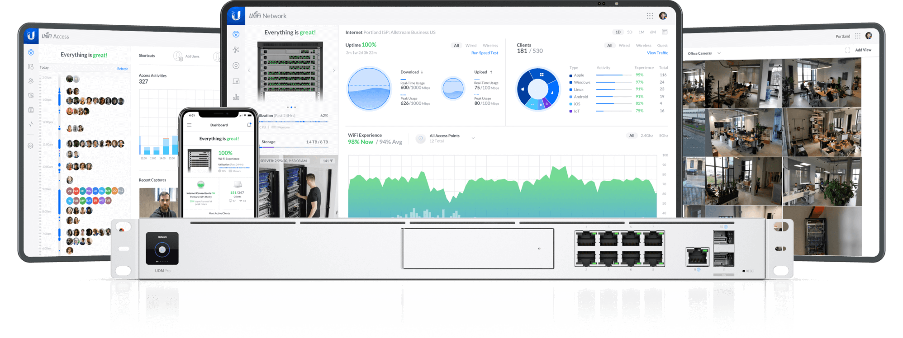

# Unifi

<div align="center">
    <a href="https://www.ui.com/">
        
    </a>
    <br>
    <h3>Ubiquiti networks x Unifi©</h3>
</div>

Unifi es una plataforma de red desarrollada por Ubiquiti Networks que proporciona soluciones de administración de redes escalables y de alta calidad para pequeñas y medianas empresas, así como para usuarios domésticos avanzados. La plataforma Unifi permite a los usuarios controlar y supervisar de manera centralizada sus redes de acceso, puntos de acceso inalámbricos, cámaras de seguridad, interruptores y otros dispositivos de red mediante una interfaz de usuario intuitiva y fácil de usar. Unifi también ofrece una variedad de características avanzadas, como la capacidad de crear redes de invitados personalizadas, implementar políticas de seguridad, monitorear el rendimiento de la red y administrar dispositivos a través de la nube. En general, Unifi es una solución de red completa y confiable para aquellos que buscan una forma fácil y eficiente de administrar sus redes.

## Consola Unifi

<p align="center">
  
</p>

## Consola Unifi aplicación escritorio
Enlace a la guía de la consola: <a href="https://www.ui.com/downloads/guides/UniFi/UniFi_Controller_V5_UG.pdf">Link</a>

<details>
<summary>Enlace de descarga UniFi Network Application</summary>

<Original>&nbsp;Enlace de descarga UniFi Network Application dependiendo de cual es su plataforma:</Original>

<p>  &nbsp;&nbsp;<code>Linux</code>: <a href="https://www.ui.com/download/unifi/unifi-ap-ac-pro/uap-ac-pro/unifi-network-application-7383-unifi-os-consoles-and-debianubuntu#">Debian/Ubuntu</a></p>
<p>  &nbsp;&nbsp;<code>Windows</code>: <a href="https://www.ui.com/download/unifi/unifi-ap-ac-pro/uap-ac-pro/unifi-network-application-7383-windows#">Windows</a></p>
<p>  &nbsp;&nbsp;<code>MacOS</code>: <a href="https://www.ui.com/download/unifi/unifi-ap-ac-pro/uap-ac-pro/unifi-network-application-7383-or-macos#">macOS</a></p>

<sup>Atención: Esto es para el UniFi Network Application 7.3.83 del uap-ac-pro.</sup>
</details>
&nbsp;


## Consola Unifi docker
[](https://www.ui.com/download/unifi/)

### Instalación
<p>Enlace de descarga del docker compose de instalación:</p>
<p><a title="download" href="./UnifiDocker/docker-compose.yaml"></a></p>
<p>Accedemos a la carpeta donde creamos el docker compose y levantamos el contenedor:</p>

```bash
cd UnifiDocker && \
docker-compose up -d
```
El primero en desplegarse, tienes que descargar la imagen y el paquete Unifi, puedes monitorizarlo desde el comando logs, espera al menos 5 minutos (dependiendo del ordenador donde lo despliegues) antes de cargar la web.

### Acceso al dasboard
Access to URL `https://IP_HOST:8443`

<p align="center">
  
</p>

## UAC PRO
Unifi UAC Pro es un punto de acceso inalámbrico de alta calidad desarrollado por Ubiquiti Networks como parte de su plataforma Unifi. Este dispositivo cuenta con una tecnología avanzada de antenas múltiples para proporcionar una cobertura de alta velocidad y de gran alcance en entornos de alta densidad de usuarios, lo que lo convierte en una excelente opción para pequeñas y medianas empresas, así como para usuarios domésticos avanzados. El Unifi UAC Pro está diseñado para ser fácil de implementar y administrar a través de la plataforma Unifi, lo que permite a los usuarios configurar y monitorear de manera centralizada sus redes inalámbricas, establecer políticas de seguridad, realizar actualizaciones de firmware y más. En resumen, el Unifi UAC Pro es una excelente opción para aquellos que buscan una solución de red inalámbrica potente y fácil de administrar para sus negocios o hogares.

### firmware
Enlace al firmware: <a href="https://www.ui.com/download/unifi/unifi-ap-ac-pro/uap-ac-pro">Link</a>

### Error Adopción Pendiente en Unifi
En el siguiente enlace podemos solucionar el error de adopción de un equipo Unifi: <a href="https://azagramac.gitbook.io/myblog/unifi/error-adopcion-pendiente-en-usg-security-gateway">Link</a>

### Crear VLAN en UniFi Controller

Entramos en nuestro UniFi Controller, y nos vamos a ajustes


Seleccionamos "Redes"


En esa pantalla veremos las redes (VLANs) creadas, ahora vamos a crear una. Click en "Crear Nueva Red"


Seleccionamos:

* **Finalidad:** Corporativo
* **Grupo de red:** LAN
* **VLAN:** pondremos el valor numerico que deseemos, ejemplo "10"
* **IP Puerta enlace:** rango de IP que queramos con el [CIDR](https://azagramac.gitbook.io/myblog/linux/cidr-mascaras-de-subred), ejemplo: "10.5.10.1/24"
* **Nombre de dominio:** opcional
* **Servidores de DNS:** ejemplo 1.1.1.1 y 1.0.0.1

y guardamos los cambios, esperamos a que se aprovisione y tendremos nuestra VLAN.

Ahora definiremos un puerto del switch a nuestra VLAN, nos vamos a dispositivos y pinchamos en el swtich, en nuestro caso es el US-8-150W


Seleccionamos "Puertos"


Elegimos el puerto donde vamos a tener la VLAN y lo editamos.&#x20;


En perfil del puerto del conmutador, elegimos la VLAN creada, en este ejemplo la VLAN es "Network NAS", lo marcamos, guardamos y esperamos a que termine de aprovisionar los cambios.&#x20;


Ya solo nos queda pinchar en el puerto el dispositivo.

### Más tutoriales de Unifi
En el siguiente enlace podemos ver más tutoriales de Unifi: <a href="https://azagramac.gitbook.io/myblog/unifi">Link</a>

## Conclusión
Con esta información puedes configurar un EdgeMax© para sustituir un router neutro. Aquí podrás encontrar todo lo que he conseguido hacer con este router. Los pasos anteriormente explicados están basados en una red que puede diferir de la que tú tienes montada. Si sigues al pie de la letra todos los pasos, pueden no coincidir con la configuración de tu `red` y dejarla inservible. Adapta en todo momento la documentación que se ha expuesto para que cuadre con tu red.

<sup>Estos archivos/textos se proporcionan "TAL CUAL", sin garantías de ningún tipo, expresas o implícitas, incluidas, entre otras, las garantías de comerciabilidad, idoneidad para un fin determinado y no infracción. En ningún caso los autores o los titulares de los derechos de autor serán responsables de ninguna reclamación, daño u otra responsabilidad derivada de, o relacionada con los archivos o el uso de los mismos.</sup>

<sub>Todas y cada una de las marcas registradas son propiedad de sus respectivos dueños.</sub>

<p><sup>Iré actualizando información y añadiendo procedimientos cuando tenga tiempo libre.</sup></p>
